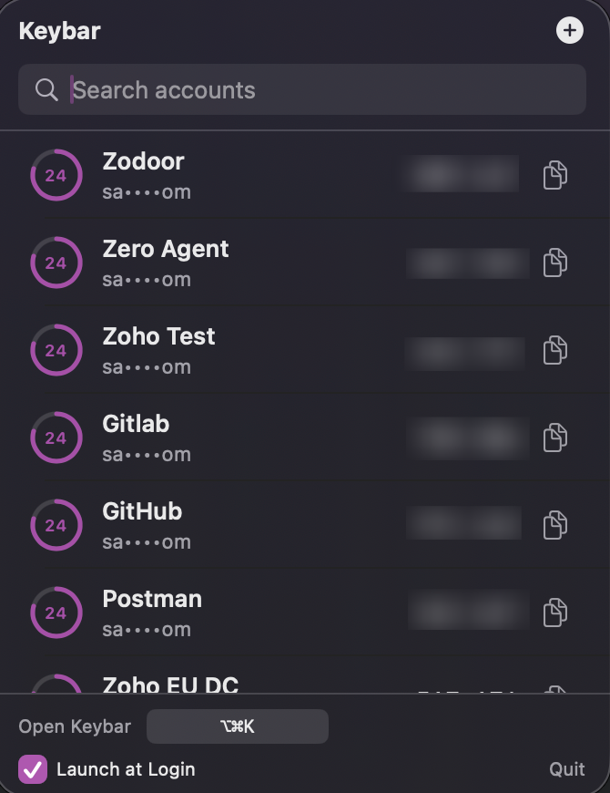

# Keybar

A native macOS menu bar TOTP (RFC 6238) authenticator. Keybar lives entirely in the menu bar — there is no Dock icon and no main window.

## How TOTP works

TOTP (Time-based One-Time Password) is a standard for generating temporary, one-time passwords based on a shared secret and the current time. The algorithm uses the HMAC (Hash-based Message Authentication Code) function to generate a unique code that changes every 30 seconds (by default). 

When you set up TOTP for an account, you typically scan a QR code or enter a secret key provided by the service. This secret key is stored securely in your Keychain, and Keybar uses it to generate the TOTP codes whenever you need them.

## How this app works

Keybar is a macOS menu bar application that generates TOTP codes locally on your device. It uses the CryptoKit framework to perform HMAC calculations based on the shared secret and the current time, following the specifications outlined in RFC 6238 and RFC 4226.

It stores the secrets securely in the macOS Keychain, ensuring that they are never exposed or stored in plaintext on disk. The app provides a user-friendly interface for managing your TOTP accounts, including adding, editing, deleting, and reordering them. You can also import accounts via QR codes using Vision's barcode detection capabilities.

This app is designed to be fully offline, meaning it does not make any network requests, ensuring your TOTP secrets remain private and secure.

## Screenshots

## Features

- TOTP codes generated locally with CryptoKit's `HMAC` (SHA1 / SHA256 / SHA512),
  implemented directly against RFC 6238 / RFC 4226. See
  [`Keybar/TOTP/TOTPEngine.swift`](Keybar/TOTP/TOTPEngine.swift).
- Configurable digit count (6 or 8) and period (default 30s) per account.
- Secrets are stored **only** in the macOS Keychain
  (`kSecClassGenericPassword`), keyed by a per-account UUID. Non-secret
  metadata (issuer, label, algorithm, digits, period, UUID, sort order) is
  stored locally as JSON in Application Support. The raw secret never touches
  disk outside the Keychain.
- Menu bar dropdown with live-updating codes, a circular countdown ring,
  click-to-copy (row or dedicated button) with a checkmark confirmation,
  search-when-crowded, add/edit/delete/reorder, and QR import via Vision's
  `VNDetectBarcodesRequest`.
- A user-configurable global keyboard shortcut (default ⌥⌘K) opens the
  dropdown without touching the menu bar icon.
- Fully offline — Keybar makes no network requests.

## Using the app

- Click the menu bar icon (or press ⌥⌘K, configurable in the dropdown footer)
  to open the dropdown.
- Click **+** to add an account manually, or choose **Import from QR Code…**
  to drag/drop or paste a screenshot of a QR code.
- Click anywhere on a row, or its copy icon, to copy the current code — it
  briefly shows a checkmark to confirm.
- Right-click a row for Edit/Delete.
- Once you have more than 5 accounts, a search field appears at the top and
  filters live as you type.

## Opening the app.

1. Download the latest release from the [releases page](https://github.com/saravanakumar-ru-ZPT-0121/KeyBar/releases/tag/v1.0)
2. Extract the zip file and move the Keybar app to your expected folder.
3. Open Keybar. You may need to allow it in System Preferences → Security & Privacy → General. 
4. Or Run `xattr -d com.apple.quarantine /Applications/Keybar.app` in Terminal to remove the quarantine attribute. (xattr -cr /path/to/Keybar.app also works, but is more destructive.)
5. If you want to use the global keyboard shortcut, you will need to allow Keybar in System Preferences → Security & Privacy → Privacy → Accessibility.

